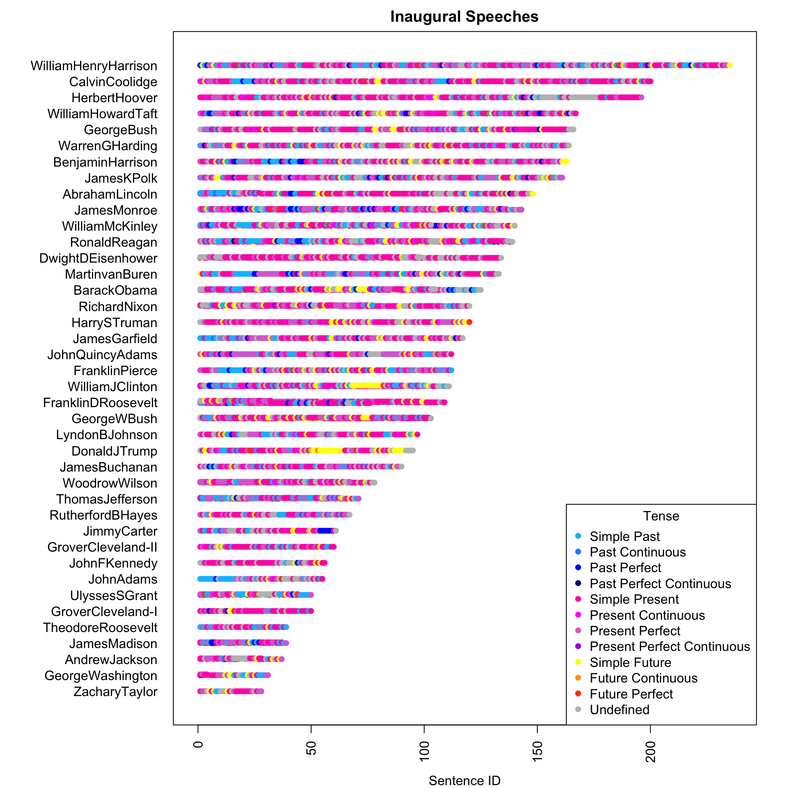
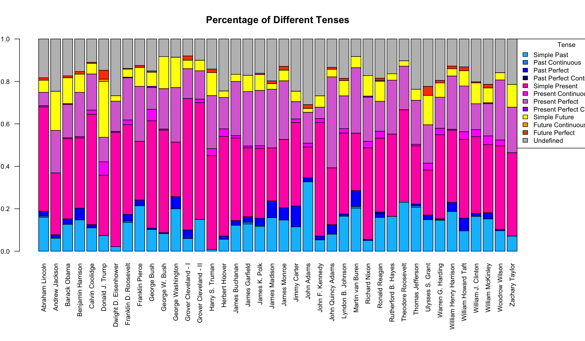

# Spring 2017
# Project 1: What did the presidents say at their inauguration?


### [Project Description](doc/)
This is the first and only *individual* (as opposed to *team*) this semester. 

Term: Spring 2017

+ Projec title: Tense Analysis in Inaugural Speech
+ This project is conducted by [Jingwen Yin]

+ Project summary: In this project, I did simple tense analysis to see how presidents structure their inaugural speech, what percent of their speeches referred to present/past/future, and how the tense of sentences change throughout their speech. I also combined tense and sentiment analysis to see presidents' emotions when they referred to different time and when they talked about the past in different terms.

+ Interesting findings: 
	+ No one has ever used Future Perfect Continuous at their inauguration!
	+ Most of Presidents did change their tense very often during the inauguration!
	+ Every president included simple present tense much of their speech. President Adams used simple past the most. And President Trump used most simple future tense!
	+ Past tense has higher score for positive emotions than present tense like anticipation, joy, trust. Present tense has lowest positive score!
	+ For those presidents who gave two inaugural speeches, they have higher positive emotion score at their first term inauguration and higher negative emotion score at the second term inauguration!

+ Rmd File Link(https://github.com/TZstatsADS/Spr2017-Proj1-aurora1994/blob/master/doc/Project1.Rmd)

+ Visualization:




Following [suggestions](http://nicercode.github.io/blog/2013-04-05-projects/) by [RICH FITZJOHN](http://nicercode.github.io/about/#Team) (@richfitz). This folder is orgarnized as follows.

```
proj/
├── lib/
├── data/
├── doc/
├── figs/
└── output/
```

Please see each subfolder for a README file.
