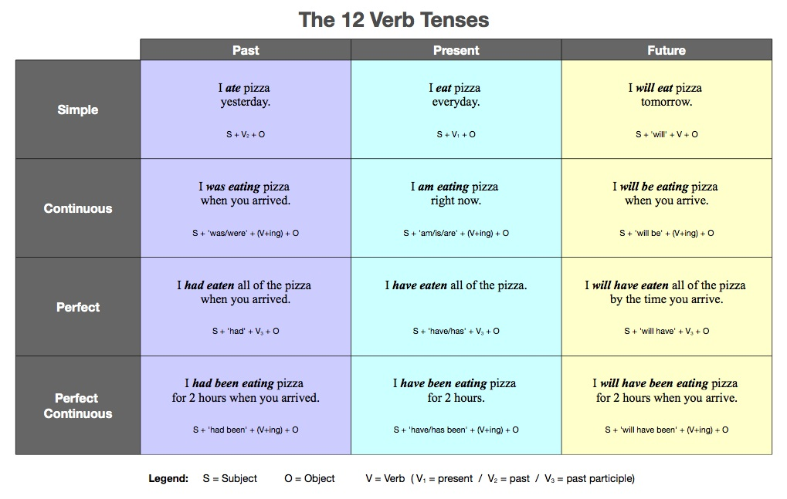

### Grammar Question: How many tenses in English?
English has three main tenses: present, past, and future. Each of these main tenses has sub-tenses. Here are the twelve English tenses:

**New Package**: The NLP, openNLP, and openNLPmodels.en packages are needed for function
Maxent_POS_Tag_Annotator() which will do the part-of-speech tagging, a process of marking up a word in a text (corpus) as corresponding to a particular part of speech, based on both its definition and its context. (https://en.wikipedia.org/wiki/Part-of-speech_tagging)
```{r, message=FALSE, warning=FALSE}
# Check and install needed packages. Load the libraries and functions. 
packages.used=c("rvest", "tibble", "qdap", 
                 "gplots", "dplyr","tm", "syuzhet", 
                "beeswarm", "scales", "RColorBrewer",
                "NLP", "openNLP", "ggplot2", "tidyr","openNLPmodels.en")

packages.needed=setdiff(packages.used, 
                        intersect(installed.packages()[,1], 
                                  packages.used))

if(length(packages.needed)>0){
  install.packages(packages.needed, dependencies = TRUE)
}

packages.needed=setdiff("openNLPmodels.en", 
                        intersect(installed.packages()[,1], 
                                  "openNLPmodels.en"))
if(length(packages.needed)>0){
  install.packages("http://datacube.wu.ac.at/src/contrib/openNLPmodels.en_1.5-1.tar.gz",
                  repos=NULL, type="source")
}

options(java.parameters = "- Xmx8g")
library("rvest")
library("tibble")
library("qdap")
library("gplots")
library("dplyr")
library("tm")
library("syuzhet")
library("beeswarm")
library("scales")
library("RColorBrewer")
library("tm")
library("NLP")
library("openNLP")
library("openNLPmodels.en")

# A function assigns tense to each sentence in the text based on tense principle.
source("../lib/sentTagFunc.R") 
source("../lib/speechFuncs.R")

main.page <- read_html(x = "http://www.presidency.ucsb.edu/inaugurals.php")
inaug=f.speechlinks(main.page)
inaug=inaug[-nrow(inaug),] 
inaug.list=read.csv("../data/inauglist.csv", stringsAsFactors = FALSE)
inaug.list=cbind(inaug.list, inaug)
inaug.list$fulltext=NA
for(i in seq(nrow(inaug.list))) {
  text <- read_html(inaug.list$urls[i]) %>% 
    html_nodes(".displaytext") %>% 
    html_text() 
  inaug.list$fulltext[i]=text
  filename <- paste0("../data/fulltext/", 
                     inaug.list$type[i],
                     inaug.list$File[i], "-", 
                     inaug.list$Term[i], ".txt")
  sink(file = filename) %>% 
  cat(text) 
  sink() 
}

if("ggplot2" %in% (.packages())){
  detach("package:ggplot2", unload=TRUE) 
}
```
**New Function**: sentTag, a function assigns tense to each sentence in the text based on tense principle.

**Notice**: Since both NLP and ggplot2 packages have annotate function, we have to detach package ggplot2 and any other package that needs ggplot2.

**Notice**: I saved an RData generated by next chunk and put it in output folder, since next chunk would take about 90 minutes to run. I will load a prepared RData for the following steps. If interested, you can switch the codes by setting (eval=T), uncomment the code, and be patient to wait for the results. Otherwise, please do not run the chunk below!
```{r, eval=FALSE, warning=FALSE, message=FALSE}
# sentence.list=NULL
# for(i in 1:nrow(inaug.list)){
#   sentences=sent_detect(inaug.list$fulltext[i],
#                         endmarks = c("?", ".", "!", "|",";"))
#   if(length(sentences)>0){
#     emotions=get_nrc_sentiment(sentences)
#     tense=sentTag(sentences)
#     sentence.list=rbind(sentence.list, 
#                         cbind(inaug.list[i,-ncol(inaug.list)],
#                               sentences=as.character(sentences), 
#                               tense,
#                               emotions,
#                               sent.id=1:length(sentences)
#                               )
#     )
#   }
# }
```
#Part I: Simple Tense Analysis
###Question 1: How many sentences in each tense in total?
```{r}
# load a prepared RData 
load("../output/Project1.RData")
table(sentence.list$tense)
```
###Interesting fact 1: No one has ever used Future Perfect Continuous at their inauguration!

***

###Question 2: What sentences are assigned as Undefined?
```{r}
head(sentence.list$sentences[sentence.list$tense=="Undefined"])
```
#####Undefined Sentences: Short or long phrase, Compound Sentences with modal words, Interrogative sentences...

***

###Question 3: How the tenses changed throughout their inaugural speech?
#####Assumption: They may not change the tenses frequently. Maybe they talked about the past first, and then the present, and future in the end.
```{r, fig.width = 5, fig.height = 5}
sentence.list$File=factor(sentence.list$File)

sentence.list$FileOrdered=reorder(sentence.list$File, 
                                  sentence.list$sent.id, 
                                  max, 
                                  order=T)
par(mar=c(4, 11, 2, 2))

# Assign color to each tense 
Tense<-c("Simple Past", "Past Continuous", "Past Perfect", "Past Perfect Continuous", "Simple Present", "Present Continuous", "Present Perfect", "Present Perfect Continuous", "Simple Future","Future Continuous","Future Perfect","Undefined")
MyColors<-c("deepskyblue","dodgerblue", "blue","navy","maroon1","magenta","orchid", "purple","yellow","orange","orangered", "grey")
tenseColor<-factor(sentence.list$tense, levels = Tense, labels = MyColors)
# Beeswarm Plot to show the changes of tense during their inauguration.
beeswarm(sent.id~FileOrdered, 
         data=sentence.list,
         horizontal = TRUE,
         pch=16, pwcol=as.character(tenseColor),
         cex=1, cex.axis=1, cex.lab=1,
         spacing=5/nlevels(sentence.list$FileOrdered),
         las=2, ylab="", xlab="Sentence ID",
         main="Inaugural Speeches")
legend("bottomright", legend = Tense,
         title = "Tense", pch = 16, cex=1, col = MyColors)
```
###Interesting Fact 2: Most of Presidents did change their tense very often during the inauguration!


***

###Question 4: What percent of sentences referred to each tense for every president?
```{r, fig.height=3.5, fig.width=6}
count<-table(sentence.list$tense,factor(sentence.list$President))
count<-prop.table(count,2)
count<-count[match(Tense,rownames(count)),]
par(mfrow=c(1, 1), mar=c(9, 2, 4, 5))
barplot(count, main="Percentage of Different Tenses", ylab="Percentage",
        col=MyColors,bty='L',
        las=2,cex.axis = 0.8, cex.names=0.8)
par(xpd=TRUE)
legend(48,1,legend = Tense,
         title = "Tense", cex=0.8, fill = MyColors)
```
###Interesting Fact 3: Every president included simple present tense much of their speech. President Adams used simple past the most. And President Trump used most simple future tense!


***
***


#Part II: Tense Analysis and Sentiment Analysis Combination
###Question 5: What emotion did presidents have when they used different tense?
#####Assumption: They may have more negative emotion when they talked about the past and have more postive emotion when they talked about present and future.
```{r, fig.height=3, fig.width=5, warning=FALSE, message=FALSE}
library(ggplot2)
library(tidyr)
# Merge the sub-tenses into main tenses and calculate the mean emotion scores for each main tenses.
past<-sentence.list[sentence.list$tense=="Simple Past"|sentence.list$tense=="Past Perfect"|sentence.list$tense=="Past Continuous"|sentence.list$tense=="Past Perfect Continuous",]
present<-sentence.list[sentence.list$tense=="Simple Present"|sentence.list$tense=="Present Perfect"|sentence.list$tense=="Present Continuous"|sentence.list$tense=="Present Perfect Continuous",]
future<-sentence.list[sentence.list$tense=="Simple Future"|sentence.list$tense=="Future Perfect"|sentence.list$tense=="Future Continuous"|sentence.list$tense=="Future Perfect Continuous",]
past.emo<-sapply(past[,12:21],mean)
present.emo<-sapply(present[,12:21],mean)
future.emo<-sapply(future[,12:21],mean)
time.emo<-cbind(rep(1:10,3),c(past.emo,present.emo,future.emo),c(rep("Past",10),rep("Present",10),rep("Future",10)))
colnames(time.emo)<-c("ID","Score","Tense")
rownames(time.emo)<-NULL
time.emo<-data.frame(time.emo)
time.emo$Score<-round(as.numeric(as.character(time.emo$Score)),2)
ggplot(data=time.emo)+ geom_point(aes(x=ID, y=Score,color=Tense, shape=Tense, size=1))+
  scale_x_discrete(name="Emotion", breaks = seq(1,10,by=1),labels = as.character(names(past.emo)))+
  labs(title="Comparison of Sentiments in Different Tense", y="Score")
```
###Interesting Fact 4: Past tense has higher score for positive emotions than present tense like anticipation, joy, trust. Present tense has lowest positive score!


***


###Question 6: For those presidents who gave two inaugural speeches, what is the differece in emotion when they talked about the past at their two inauguration?
#####Assumption: They may have higher positive emotion score and lower negative emotion score at their second inauguration.
```{r, fig.height=3, fig.width=5}
past$President[past$President=="Grover Cleveland - I"|past$President=="Grover Cleveland - II"]<-"Grover Cleveland"
# Take out the 2-term presidents and calculate the mean emotion score for each term.
twoTermList<-as.character(levels(factor(past$President[past$Term==2])))
twoTerm<-NULL
for(i in 1:length(twoTermList)){
  twoTerm<-rbind(twoTerm, past[past$President==twoTermList[i],])
}
Term1<-sapply(twoTerm[twoTerm$Term==1,12:21],mean)
Term2<-sapply(twoTerm[twoTerm$Term==2,12:21],mean)
Term<-cbind(rep(1:10,2),c(Term1,Term2),c(rep("Term1",10),rep("Term2",10)))
colnames(Term)<-c("ID","Score","No.Term")
rownames(Term)<-NULL
Term<-data.frame(Term)
Term$Score<-round(as.numeric(as.character(Term$Score)),2)
ggplot(data=Term)+ geom_point(aes(x=ID, y=Score, color=No.Term, shape=No.Term, size=1))+
  scale_x_discrete(name="Emotion", breaks = seq(1,10,by=1),labels = as.character(names(Term1)))+
  labs(title="Comparison of Sentiments in Different Terms", y="Score")
```
###Interesting Fact 5: For those presidents who gave two inaugural speeches, they have higher positive emotion score at their first term inauguration and higher negative emotion score at the second term inauguration!